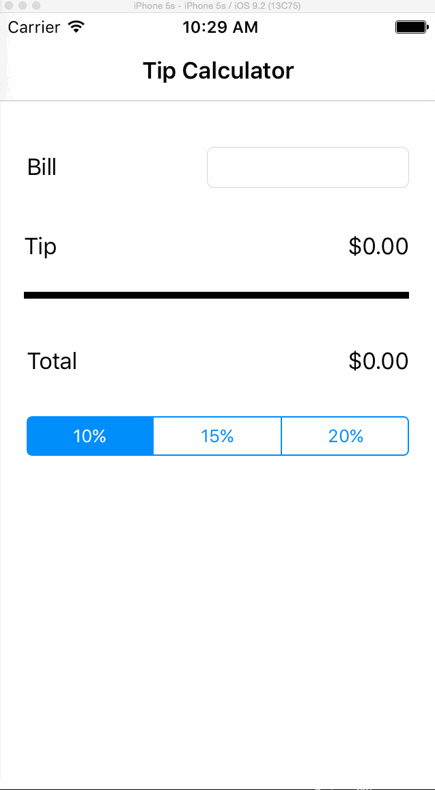

# Pre-work - tipcalc

tipcalc is a tip calculator application for iOS.

Submitted by: Nadeem Visanji

Time spent: 2 hours spent in total

## User Stories

The following **required** functionality is complete:
* [X] User can enter a bill amount, choose a tip percentage, and see the tip and total values.

The following **optional** features are implemented:
* [ ] Custom font
* [ ] UI animations
* [ ] Making sure the keyboard is always visible and the bill amount is always the first responder. This way the user doesn't have to tap anywhere to use this app. Just launch the app and start typing.

## Video Walkthrough 

Here's a walkthrough of implemented user stories: 

GIF created with [LiceCap](http://www.cockos.com/licecap/).

## Notes

The only challenge encountered was that the keyboard disappeared and I was not able to get it back. Received the following error "2016-05-12 11:17:38.554 tipcalc[23815:1355520] Can't find keyplane that supports type 8 for keyboard iPhone-Portrait-DecimalPad; using 4131139949_Portrait_iPhone-Simple-Pad_Default"

## License

    Copyright 2016 Nadeem Visanji

    Licensed under the Apache License, Version 2.0 (the "License");
    you may not use this file except in compliance with the License.
    You may obtain a copy of the License at

        http://www.apache.org/licenses/LICENSE-2.0

    Unless required by applicable law or agreed to in writing, software
    distributed under the License is distributed on an "AS IS" BASIS,
    WITHOUT WARRANTIES OR CONDITIONS OF ANY KIND, either express or implied.
    See the License for the specific language governing permissions and
    limitations under the License.
